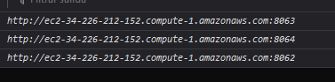

# Taller Modularización

## Arquitectura

Se mantiene la arquitectura propuesta en el taller. Se encontrará un contenedor
con el **Front**; en este se encuentra el html y el balanceador de cargas, además de 
ser el encargado de enviar y recibir peticiones, 3 contenedores **Back**; en estos se
reciben las peticiones, se envían a la base de datos y hará las peticiones necesarias
a la misma, por último, el contenedor **base de datos**, en este caso se usa MongoDB. 

## Desarrollo 

Se realiza la implementación de LogService en java, la implementación del Front utilizando
Bootstrap y la implementación de la base de datos usando la imagen de mongoDb en un contenedor. 

Para desplegar los contenedores, se genera un docker-compose, en este se especifica los contenedores
que se quieren crear, los puertos que usarán y las conexiones que tienen entre ellos. 
Al tenerlo, se usa el comando `docker-compose up` para que comience la generación de las imagenes
necesarias y finalmente la construcción de los contenedores. 

Cuando se tenga claridad de que ya se puede correr de manera local, se crea un repositorio en 
git para subir los archivos, de esta manera facilitara el despliegue en AWS. 

### Despliegue de manera Local

### Despliegue en AWS

Para el despligue en AWS, es necesario crear una instancia de una máquina **EC2**. Al crear la instancia es 
necesario seleccionar ciertos parametros como: 
- Amazon Machine Image(AMI): Amazon Linux 2 AMI (HVM) - Kernel 5.10, SSD Volume Type
- Tipo de Instancia: t2.micro
 Para lanzar la instancia, es necesario generar un nuevo par de llaves, estas se crearan y descargarán donde se crea
más conveniente. 

Cuando se tiene la instancia corriendo, se ingresa desde la consola a la instancia. Se instalan 
los programas que sean necesarios, en este caso, se instaló **_Docker_**, **_docker-compose_** y **_Git_**

- Instalación de Docker
  

- Instalación de docker-compose
  

- Instalación de Git
  

Al tener la máquina con esto, es posible clonar el repositorio en el que anteriormente
se subieron los archivos. 

- Repositorio clonado
  

Con el repositorio clonado, se usa nuevamente el comando `docker-compose up` para generar 
las imagenes y realizar la construcción de los contenedores. 

- Contenedores corriendo
  

Para poder acceder a los endpoints creados, es necesario abrir los puertos de la máquina 
virtual, para esto, se generan nuevas reglas en el **Security Group** de ella. 

- Nuevas reglas para el Security Group
  

Finalmente, es posible dirigirse a la dirección de la máquina y realizar las pruebas correspondientes

- Aplicación en AWS
  

El funcionamiento del RoundRobin se ve en la consola con los logs que se 
definieron. Con cada petición, se cambia el puerto al que se realiza la 
petición. 
 
- Round Robin
  

## Construido con
- Spark, como Framework de Java para el desarrollo Backend.
- Bootstrap, como Framework para el diseño Frontend.
- JavaScript, como lenguaje usado en el cliente para manejar los eventos del usuario. 
- Docker y docker-compose, como herramienta para la generación y control de los contenedores. 

## Autor
-  Laura García 